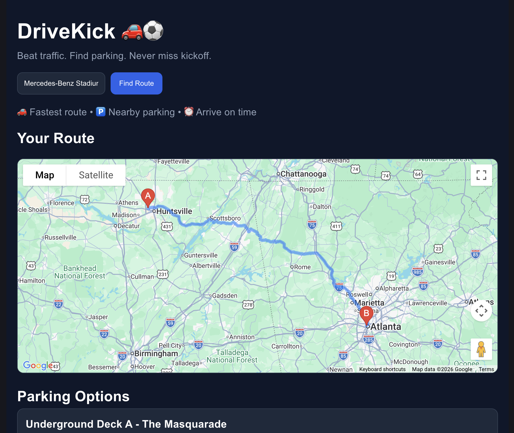
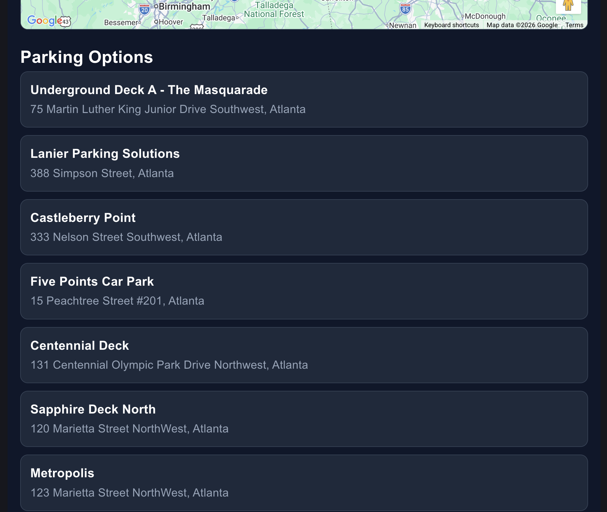

# DriveKick 🚗⚽

DriveKick is a web app that helps users find the fastest route to stadiums and discover nearby parking spots.

## 🚀 Features

- 📍 Autocomplete stadium search
- 🗺️ Real-time directions using Google Maps
- 📍 User location detection
- 🅿️ Nearby parking suggestions

## 🛠 Tech Stack

- React
- Google Maps JavaScript API
- Places API
- CSS

## 📸 Demo

## ⚙️ Setup

1. Clone the repo
2. Create a `.env` file
3. VITE_GOOGLE_MAPS_API_KEY=your_api_key
4. Run

## 🎯 Future Improvements

- Travel time + ETA
- Smarter parking recommendations
- UI enhancements
